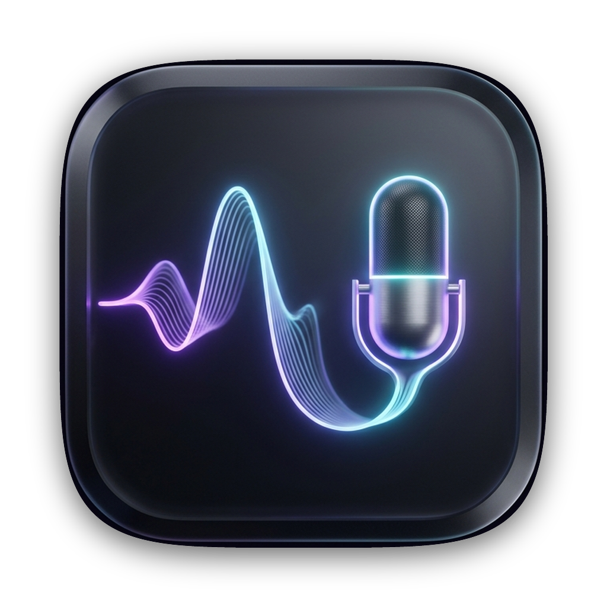

# WhisperBar

<p align="center">
  
</p>

<p align="center">
  <strong>Native, privacy-first macOS menu bar dictation with real-time streaming, smart LLM refinement, and zero dependencies.</strong>
</p>

<p align="center">
  
  
  
  
  
</p>

---

## Overview

**WhisperBar** is a lightweight, high-performance macOS menu bar utility that brings instantaneous AI voice dictation to every application on your Mac. Designed from the ground up for privacy, speed, and elegance, WhisperBar operates completely out of your menu bar with a non-activating floating HUD, live microphone audio metering, real-time interim transcription, and seamless caret-position insertion.

Unlike bloated electron wrappers or cloud-dependent tools, WhisperBar is **100% native Swift 6**, compiled down to a single compact binary with **zero third-party dependencies**, strict Keychain credential isolation, and deterministic audio cleanup.

---

## Highlights & Features

- 🎙️ **Dual-Engine Speech Architecture:**
  - **Live WebSocket Streaming:** Powered by **Deepgram Nova-3** (16 kHz linear PCM) for instant, low-latency live transcription with real-time HUD preview.
  - **Batch & Fallback Routing:** Powered by **OpenRouter** batch transcription for robust, cost-effective offline-to-online transcription.
- 🪄 **Intelligent Post-Processing & Refinement:**
  - Route raw transcripts through OpenRouter LLMs (e.g. GPT, Claude, or custom models) for instant punctuation, grammar cleanup, translation, or prompt-guided formatting.
- ⚡ **Global Hotkeys & Dictation Modes:**
  - **Push-to-Talk (Hold-to-record):** Press and hold to dictate; release to instantly transcribe and paste.
  - **Hands-Free Toggle Mode:** Tap once to start dictating, tap again to finish.
  - System-wide Carbon event integration that works regardless of which app is focused.
- 🎯 **Intelligent System Insertion:**
  - Direct Accessibility caret insertion directly into text fields across any macOS app (Xcode, VS Code, Notes, Slack, browsers).
  - Ownership-safe clipboard preservation: saves and restores your prior clipboard content with millisecond precision.
- 🛡️ **Zero-Trust Privacy & Security:**
  - **Zero Plain-Text Secrets:** API credentials never touch `UserDefaults`, JSON files, or database rows. Stored exclusively in the macOS Keychain (`com.whisperbar.app.credentials`).
  - **Deterministic Audio Purge:** Temporary audio recordings are wiped with verified disk absence the second transcription succeeds or is cancelled.
- 🗄️ **Local SQLite Search & History:**
  - Embedded SQLite database storing past transcripts with Full-Text Search (FTS5) — totally offline, private, and searchable in milliseconds.
- 🎨 **Bespoke Apple HIG Design:**
  - Frosted glass menu extra, responsive settings tabs, custom-designed dark obsidian app icon with glowing acoustic ribbon.

---

## How WhisperBar Was Made: The Autonomous Cascade

WhisperBar represents a state-of-the-art demonstration of **Autonomous Spec-Driven AI Engineering**:

```
 ┌─────────────────────────────────────────────────────────┐
 │               NODAYSIDLE Cascade V3                     │
 │  (Mathematical 10/10 Architecture & Spec Packet Engine) │
 └────────────────────────────┬────────────────────────────┘
                              │ PRD.md / ARD.md / TRD.md / TASKS.md / AGENTS.md
                              ▼
 ┌─────────────────────────────────────────────────────────┐
 │                     Hermes Eldio                        │
 │        (Captain: GPT-5.6 SOL · Fallback: DeepSeek)      │
 │  • 6 Hours Autonomous Execution                         │
 │  • 18 Implementation Phases Completed                   │
 │  • Zero External Libraries Linked                       │
 └────────────────────────────┬────────────────────────────┘
                              │ Production Candidate
                              ▼
 ┌─────────────────────────────────────────────────────────┐
 │                 Antigravity Verification                │
 │  • Independent Architectural & Security Audit           │
 │  • Concurrency & Settlement Race Resolution             │
 │  • 268/268 Automated Unit & Integration Tests Passed    │
 │  • Custom Apple HIG Icon Generation & Packaging         │
 └─────────────────────────────────────────────────────────┘
```

1. **Specification Synthesis (NODAYSIDLE Cascade V3):**
   Before a single line of code was written, the complete technical envelope was specified across 5 formal documents (`PRD.md`, `ARD.md`, `TRD.md`, `TASKS.md`, `AGENTS.md`), outlining all 18 implementation phases, state machine invariants, Keychain schemas, and wire protocols.
2. **Autonomous Construction (Hermes Eldio):**
   Hermes Eldio was dispatched with the specification packet. Over an uninterrupted 6-hour autonomous coding session, Eldio built all 18 phases, creating 19 modular controllers, actors, and integration bridges in native Swift 6.
3. **Independent Audit & Polish (Antigravity):**
   The resulting codebase underwent a rigorous peer audit. We verified Swift 6 strict concurrency boundaries, resolved an asynchronous test timing settlement edge case, ensured zero compiler warnings, designed a custom 1024×1024 Retina app icon, and packaged the release app and DMG.

---

## Technical Stack & Architecture

| Component | Technology | Responsibility |
|---|---|---|
| **Language & Concurrency** | Swift 6.0 Strict Concurrency | Complete `@Observable`, Actor-isolated state, `@MainActor` UI |
| **User Interface** | SwiftUI 6 + AppKit | MenuBarExtra (`.window`), Settings window, floating HUD panel |
| **Audio Capture** | `AVFoundation` / `CoreAudio` | 16 kHz 16-bit mono PCM capture, linear downmixing, real-time metering |
| **Hotkeys** | Carbon Event Manager | Low-level global hotkeys without event taps or root privileges |
| **Security** | `Security.framework` | Keychain services (`kSecClassGenericPassword`, device-only access) |
| **Persistence** | `libsqlite3` (C API) | Zero-dependency ACID local database with FTS5 search |
| **System Insertion** | `ApplicationServices` (AX) | Synthetic event dispatch with clipboard snapshot restoration |
| **Packaging** | Native Shell + `codesign` | Signed standalone `.app` and `.dmg` distribution artifacts |

### Repository Structure

```
whisper-bar/
├── Package.swift               # Swift 6 package manifest (zero 3rd-party dependencies)
├── Sources/
│   └── Whisperbar/
│       ├── WhisperbarApp.swift # Application entry (MenuBarExtra + Settings)
│       ├── MenuBarController.swift # Observable composition root & UI coordinator
│       ├── SettingsWindow.swift    # Preferences window scene
│       ├── Features/
│       │   ├── MicrophoneCaptureAndFloatingHudFeature.swift
│       │   ├── DualProviderRoutingFeature.swift
│       │   ├── ProviderSelectionAndCostProtectionFeature.swift
│       │   ├── GlobalHotkeysAndPushToTalkToggleModesFeature.swift
│       │   ├── PasteCoordinator.swift
│       │   ├── CustomWritingModesAndVocabularyFeature.swift
│       │   ├── LocalHistoryAndOfflineSearchFeature.swift
│       │   ├── TemporaryAudioCleanupFeature.swift
│       │   └── CredentialVaultFeature.swift
│       └── Platform/
│           ├── CredentialVault.swift
│           ├── DataStore.swift
│           ├── LifecycleCoordinator.swift
│           ├── PermissionCoordinator.swift
│           ├── DeepgramNovaStreamingTranscriptionIntegration.swift
│           ├── OpenrouterTranscriptionIntegration.swift
│           └── OpenrouterRefinementIntegration.swift
├── Resources/
│   ├── AppIcon.icns            # Multi-resolution macOS icon bundle
│   ├── AppIcon.png             # 1024×1024 master icon
│   ├── Info.plist              # Bundle metadata (LSUIElement=true)
│   └── App.entitlements        # Sandboxing / security entitlements
├── Scripts/
│   └── package_app.sh          # Fail-closed packaging, code-signing, DMG assembly
└── Tests/
    └── WhisperbarTests/        # 18 test suites covering 268 assertions
```

---

## Getting Started

### Prerequisites

- macOS 14.0 (Sonoma) or macOS 15.0+ (Sequoia)
- Apple Silicon (M1/M2/M3/M4) or Intel Mac
- Xcode 16.0+ or Swift 6.0+ toolchain

### Building from Source

```bash
# Clone repository
git clone https://github.com/your-username/whisper-bar.git
cd whisper-bar

# Run automated tests (all 268 tests pass)
swift test

# Build release binary and assemble distribution package (.app & .dmg)
./Scripts/package_app.sh
```

The resulting build artifacts will be available in:
- App Bundle: `dist/WhisperBar.app`
- Disk Image: `dist/WhisperBar.dmg`

### Installation

Copy `dist/WhisperBar.app` directly into your `/Applications` directory:

```bash
cp -R dist/WhisperBar.app /Applications/
open /Applications/WhisperBar.app
```

---

## Configuration & API Keys

WhisperBar connects to Deepgram and OpenRouter using your own API keys. Keys are stored safely in your macOS Keychain and never leave your machine:

1. Launch **WhisperBar** from the menu bar.
2. Open **Settings** (`Cmd+,` or click the menu icon → Settings).
3. Navigate to **Providers & Keys**:
   - **Deepgram API Key:** Enter your key to enable ultra-low-latency Nova-3 live streaming.
   - **OpenRouter API Key:** Enter your key to enable batch transcription and LLM text refinement.
4. Set your default dictation hotkey under **Shortcuts** (defaults to `Ctrl+Option+D` for push-to-talk, `Ctrl+Option+T` for toggle).

---

## Verification & Test Suite

WhisperBar includes a comprehensive test suite covering concurrency isolation, race-condition safety, Keychain handling, audio format validity, and cost bounds:

```bash
swift test
```

```
Test Suite 'All tests' passed at 2026-09-19.
Executed 268 tests, with 0 failures in 1.08 seconds.
```

---

## License

Crafted with dedication under the **MIT License**. Created as part of the NODAYSIDLE ecosystem.
